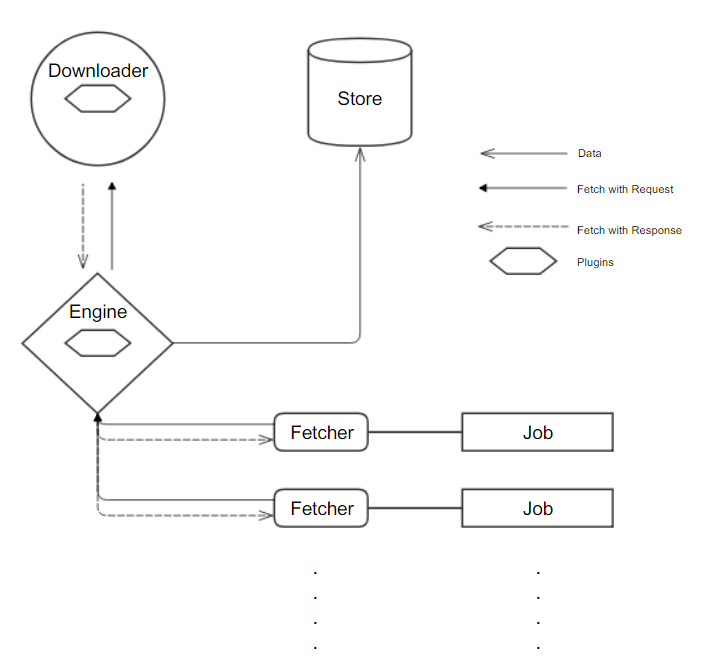

<h1 align="center">IGetter</h1>

<h2 align="center">是什么</h2>

IGetter是一个声明式、易扩展的监控型爬虫框架。

- 声明式：IGetter是一个基础的监控型爬虫框架，用户只需编写相应的解析即可。其余的调度、下载、存储由IGetter负责。
- 易扩展：IGetter使用Tapable暴露爬虫的生命周期，从发出请求到接收到响应整个过程都可控。
- 监控型：IGetter更擅长以监控信息为目的的爬虫，例如：JavaScript周报更新、BiliBili UP 主视频更新...

<h2 align="center">构成</h2>

IGetter主要分为Engine、Downloader、Job、Plugin、Store五部分。

**Engine**负责Job的添加、调度，传递Job的请求、Downloader的响应以及插件的注册。

**Downloader**是一个异步并发下载队列，负责下载Engine传递来的请求。使用superagent库来下载，如果想使用其他请求库，替换非常简单。

**Job**是使用者主要关注的地方，在这里主要进行爬虫的解析，存储。希望能利用开源的力量，将所有的Job聚集一起供用户使用，例如：知乎xxx新回答，xxx更新了微博，steamxxx游戏有更新...也是急需贡献的地方！

**Plugin**即为插件，IGetter将一个爬虫从发出请求到接收到响应整个过程使用Tapable暴露出来。可以在此做很多事情，例如：随机User-Agent、爬虫性能分析、模拟登录，爬虫监控、代理设置...

**Store**是IGetter提供的存储工具，使用nedb库，类mongoDB的语法更易使用。当然，如果想使用其他存储库，也可替换。

<p align="center">
  
</p>

<h2 align="center">例子</h2>

下面是一个简单的例子，目的是抓取`https://example.com`的title和content，并存储。
真实例子可以参考项目目录Example steamcn每日新闻。

```ts
class YourJob extends Job{
  public JobName = 'A Example Job' // 任务名称
  constructor(){
    super()
  }
  async run(){ // 任务主体
    let $ = this.$ // 内置解析器cheerio
    let pageFetch = await this.request({ // 发出请求，等待Downloader下载
      url: 'https://example.com'
    })
    let resBody = pageFetch.response.body // 获取响应
    return { // 返回的数据将会交由Engine存储值Store
      title: $('#title', resBody) // 使用cheerio获取title信息,
      content: $('#content', resBody) // 使用cheerio获取content信息
    }
  }
}
```